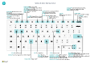

# Référence rapide de raccourcis clavier - PC uniquementKeyboard Quick Reference - PC Only

#### GénéralGeneral

|Appuyez sur les touches suivantesPress these keys|PourTo do this|  
|-|-|
|Alt+F2Alt+F2|Afficher et masquer le volet RécapitulatifShow and hide the FactBox pane|
|Alt+NAlt+N|Créer un enregistrementCreate a new record|
|Alt+Maj+NAlt+Shift+N|Fermer un enregistrement nouvellement créé et en créer un nouveauClose a newly created record and create a new one|
|Alt+OAlt+O|Ajouter une nouvelle note pour l’enregistrement sélectionnéAdd a new note for the selected record|
|Alt+QAlt+Q|Ouvrir **Dites-moi**Open **Tell me**|
|Alt+HautAlt+Up|Ouvrir une info-bulle ou une erreur de validationOpen tooltip or validation error|
|Alt+Flèche basAlt+Down Arrow|Ouvrir un menu déroulant ou une rechercheOpen a drop-down or look up|
|Alt+TAlt+T|Ouvrir la page **Mes paramètres**Open the **My Settings** page|
|Alt+Maj+WAlt+Shift+W|Ouvrir la fiche ou le document en cours dans une nouvelle fenêtreOpen the current card or document in a new window|
|Ctrl+InserCtrl+Insert|Insérer une nouvelle ligne sur un documentInsert a new line on a document|
|Ctrl+SupprCtrl-Delete|Supprimer la ligne sur un document, un journal ou une feuille de calculDelete the line on a document, journal, or worksheet|
|Ctrl+Maj+F12Ctrl+Shift+F12|Maximiser la partie des éléments de ligne sur une page de documentMaximize the line items part on a document page|
|Ctrl+F1Ctrl+F1|Ouvrir l’aide de la pageOpen help for the page Naviguer lors de la personnalisationNavigate when personalizing and customizing|
|Ctrl+ClicCtrl+Click|Naviguer lors de la personnalisationNavigate when personalizing and customizing|
|Shift+F12Shift+F12|Ouvrir l’explorateur de rôles, une vue d’ensemble des fonctionnalitésOpen the role explorer, a feature overview|
|F5/Ctrl+F5F5/Ctrl+F5|Actualiser/recharger la pageRefresh/reload page|
|Tab/Maj+TabTab/Shift+Tab|Déplacer le focus sur l’élément suivant/précédentMove focus to the next/previous element|
|F6/Maj+F6F6/Shift+F6|Accéder au raccourci/à l’élément suivantMove to next FastTab/part|

#### Naviguer et sélectionner des lignesNavigate & Select Rows

|Appuyez sur les touches suivantesPress these keys|PourTo do this|
|-|-|
|Accueil/finHome/End|Aller au premier/dernier champGo to first/last field|
|Ctrl+Accueil/FinCtrl+Home/End |Aller à la première/dernière ligneGo to first/last row|
|Ctrl+Haut/BasCtrl+Up/Down|Naviguer sans perdre la sélectionNavigate without losing selection|
|Ctrl+ACtrl+A |Sélectionner toutSelect all|
|Ctrl+EspaceCtrl+Space|Basculer la sélection de ligneToggle row selection|
|Ctrl/Shift+ClicCtrl/Shift+Click|Ajoutez la ou les lignes à la sélectionAdd the row/rows to the selection|
|Maj+Haut/BasShift+Up/Down|Ajouter une ligne au-dessus/au dessous de la sélectionAdd row above/below to selection|
|Maj+Haut/Bas de pageShift+Page Up/Down|Sélectionner les lignes visibles ci-dessus/ci-dessousSelect visible rows above/below|
|Ctrl+EnterCtrl+Enter|Focus hors de la listeFocus out of the list|

#### Copier et collerCopy & Paste

|Appuyez sur les touches suivantesPress these keys|PourTo do this|
|-|-|
|Ctrl+C/VCtrl+C/V|Copier/coller des lignesCopy/paste rows|
|F8F8|Copier le champ au-dessus dans la ligne actuelleCopy field above into current row|

#### Rechercher, filtrer et trierSearch, Filter, & Sort

|Appuyez sur les touches suivantesPress these keys|PourTo do this|
|-|-|
|Alt+F7Alt+F7|Trier la colonne dans l’ordre croissant ou décroissantSort column in ascending/descending order|
|F3F3|Basculer la rechercheToggle search|
|Maj+F3Shift+F3|Basculer le volet Filtre ; focus sur les filtres de champToggle filter pane; focus on field filters|
|Alt+F3Alt+F3|Filtrer la valeur sélectionnée de cellulesFilter on selected cell value|
|Maj+Alt+F3Shift+Alt+F3|Ajouter un filtre au champ sélectionnéeAdd filter on selected field|
|Ctrl+Alt+Maj+F3Ctrl+Alt+Shift+F3|Réinitialiser les filtresReset filters|

#### Entrée rapideQuick Entry

|Appuyez sur les touches suivantesPress these keys|PourTo do this|
|-|-|
|Ctrl+Maj+EntréeCtrl+Shift+Enter|Accéder au champ suivant Saisie rapide en dehors d’une listeGo to next Quick Entry field outside a list|
|Entrée/Maj+EntréeEnter/Shift+Enter|Accéder au champ Saisie rapide précédent/suivantGo to next/previous Quick Entry field|
##### Aperçu de l’étatReport Preview

|Appuyez sur les touches suivantesPress these keys|PourTo do this|
|-|-|
|Ctrl+Accueil/FinCtrl+Home/End|Aller à la première/dernière pageGo to the first/last page|

> [!TIP]
> Pour une version graphique imprimable, sélectionnez l’image suivante et téléchargez le fichier PDF.For a graphical, print-friendly version, choose the following image and download the PDF file.
>
> 

[!INCLUDE[footer-include](includes/footer-banner.md)]