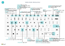

# raccourcis clavier ;

Cet article fournit un aperçu de certaines combinaisons de touches de raccourcis que vous pouvez utiliser avec lorsque vous utilisez [!INCLUDE[prod_short](includes/prod_short.md)].

Pour un aperçu des raccourcis clavier les plus courants, voir [Raccourcis clavier (PC uniquement)](keyboard-shortcuts-cheatsheet.md).

> [!TIP]
> Pour une vue graphique des raccourcis les plus utilisés, sélectionnez l’image suivante et téléchargez le fichier PDF.  
> 

## Aperçu

Les raccourcis clavier facilitent l’accessibilité et la navigation dans différentes zones et éléments d’une page. Ils sont pris en charge par la plupart des navigateurs Web ; toutefois, leur comportement peut varier légèrement.

> [!NOTE]
> Les raccourcis clavier décrits ici font référence au type de clavier en usage aux États-Unis. Il se peut que les touches des autres claviers ne correspondent pas exactement aux touches des claviers en usage aux États-Unis.

La plupart des raccourcis sont les mêmes, que le système d’exploitation soit Windows ou macOS. Cependant, certains raccourcis diffèrent pour macOS. Ces raccourcis sont indiqués entre parenthèses dans les sections suivantes.

> [!NOTE]
> Outre les raccourcis clavier globaux décrits dans cet article, un certain nombre de raccourcis spécifiques à votre activité sont disponibles. Par exemple, dans la version générique de [!INCLUDE[prod_short](includes/prod_short.md)], <kbd>F9</kbd> valide un document et <kbd>Ctrl</kbd>+<kbd>F7</kbd> affiche les écritures comptables pour un enregistrement lorsque vous ouvrez l’enregistrement dans une fiche. Cet article inclut certains des raccourcis spécifiques à l’entreprise les plus courants, qui sont affichés en italique. Sachez que les raccourcis réels peuvent être différents dans votre solution. Dans l’interface utilisateur, le raccourci clavier est affiché dans l’info-bulle de l’action en question.

## Raccourcis clavier généraux

Le tableau suivant décrit les raccourcis clavier pour naviguer et accéder aux différents éléments d’une page. Les éléments comprennent des éléments tels que des actions, des listes déroulantes, des recherches, etc. Pour en savoir plus sur les raccourcis clavier pour naviguer entre les enregistrements au sein de la liste, consultez la prochaine section.

|Sélectionnez ces touches (dans macOS)|Pour|
|--------------------------------|----------|
|<kbd>Alt</kbd>|Affichez les touches d’accès pour sélectionner des actions dans la barre d’action et le menu de navigation sur la page. Pour plus d’informations, consultez [Touches d’accès](#access-keys-for-action-bar-and-navigation-menu).|
|<kbd>Alt</kbd>+<kbd>Flèche bas</kbd>|Ouvrir une liste déroulante ou rechercher la valeur d’un champ.|
|<kbd>Ctrl</kbd>+<kbd>Option</kbd><kbd>Flèche bas</kbd>|Ouvrir la fiche d’un enregistrement associé ou la page de liste filtrée en fonction de la valeur dans le champ de recherche ou de modification assistée.|
|<kbd>Alt</kbd>+<kbd>Flèche vers le haut</kbd>|Afficher l’info-bulle pour un champ ou un en-tête de colonne d’une table. Si le champ a des erreurs de validation, sélectionnez <kbd>Alt</kbd>+<kbd>Flèche vers le haut</kbd> pour afficher l’erreur de validation. Sélectionnez <kbd>Échap</kbd> ou <kbd>Alt</kbd>+<kbd>Flèche vers le haut</kbd> pour fermer l’info-bulle.|
|<kbd>F2</kbd>|Basculez entre la sélection de la valeur entière du champ ou le placement du curseur à la fin de la valeur du champ.|
|<kbd>Alt</kbd>+<kbd>F2</kbd>|Afficher et masquer le volet Récapitulatif.|
|<kbd>Alt</kbd>+<kbd>Maj</kbd>+<kbd>F2</kbd>|<kbd>Basculer</kbd> entre **Détails** et **Pièces jointes** dans le volet Récapitulatif.|
|<kbd>Alt</kbd>+<kbd>O</kbd>|Ajouter une nouvelle note pour l’enregistrement sélectionné, même si le volet Récapitulatif n’est pas ouvert.|
|<kbd>Alt</kbd>+<kbd>Q</kbd>  (<kbd>Ctrl</kbd>+<kbd>Option</kbd>+<kbd>Q</kbd>)|Ouvrir la fenêtre **Tell Me**. Pour plus d’informations, voir [Recherche de pages et d’informations avec Tell Me](ui-search.md).|
|<kbd>Ctrl</kbd>+<kbd>Alt</kbd>+<kbd>Q</kbd>  (<kbd>Ctrl</kbd>+<kbd>Option</kbd>+<kbd>Cmd</kbd>+<kbd>Q</kbd>)|Ouvrez la page **Rechercher des écritures** pour rechercher des documents et des écritures liés les uns aux autres en fonction d’informations communes, comme le numéro de document ou la date de publication. Pour plus d’informations, voir [Recherche d’écritures associées pour les documents validés](ui-find-entries.md)|
|<kbd>Alt</kbd>+<kbd>N</kbd> |Ouvrir une page pour créer un nouvel enregistrement. (Semblable au choix des actions **Nouveau** et **+**.)|
|<kbd>Alt</kbd>+<kbd>Maj</kbd>+<kbd>N</kbd> |Fermer une page nouvellement créée et en ouvrir une nouvelle pour créer un enregistrement. De même, <kbd>Alt</kbd>+<kbd>F9</kbd> valide un document et en crée un nouveau.|
|<kbd>Alt</kbd>+<kbd>T</kbd>|Ouvrez la page **Mes paramètres**.|
|<kbd>Alt</kbd>+<kbd>Flèche droite</kbd>|Rechercher des informations supplémentaires ou des valeurs sous-jacentes pour un champ contenant le bouton . . Utilisé lorsque le bouton déroulant habituel (<kbd>Alt</kbd>+<kbd>Flèche vers le bas</kbd>) dans le même champ est utilisé à une autre fin.|
|<kbd>Ctrl</kbd>+<kbd>Alt</kbd>+<kbd>Maj</kbd>+<kbd>C</kbd>|Afficher des informations dans le badge société. Démarrer dans la 2è vague de lancement 2022 de Business Central (version 21, ce raccourci n’est plus pris en charge et remplacé par <kbd>Ctrl</kbd>+<kbd>O</kbd>. |
|<kbd>Ctrl</kbd>+<kbd>Alt</kbd>+<kbd>F1</kbd>|Ouvrez, puis fermez le volet d’inspection des pages. Ce dernier affiche les informations relatives à la page, comme sa table source, ses champs, ses filtres, ses extensions, etc.  Pour plus d’informations, reportez-vous à la rubrique [Inspection des pages](across-inspect-page.md).|
|<kbd>Ctrl</kbd>+<kbd>C</kbd> |Copiez la valeur du champ. Si le champ a le focus, et si vous n’avez pas sélectionné un texte dans le champ, l’intégralité de la valeur est copiée. Si vous avez sélectionné un texte dans le champ, seul le texte sélectionné est copié.|
|<kbd>Ctrl</kbd>+<kbd>F1</kbd>|Ouvrez le [volet d’aide](product-help-and-support.md#help-pane) ou un article d’aide de Business Central sur [Microsoft Learn](/dynamics365/business-central/), selon votre version de Business Central.|
|<kbd>Ctrl</kbd>+<kbd>F12</kbd>|Passez de la vue de mise en page développée à la vue de mise en page réduite.|
|<kbd>Ctrl</kbd>+Clic|Naviguer pendant la personnalisation lorsque l’action est mise en surbrillance avec une flèche. Pour plus d’informations, voir [Personnaliser votre espace de travail](ui-personalization-user.md).|  
|<kbd>Ctrl</kbd>+<kbd>F5</kbd>|Rechargez l’application [!INCLUDE[prod_short](includes/prod_short.md)]. (Similaire à sélectionner l’actualisation/rechargement du navigateur.)|
|<kbd>F5</kbd>|Actualiser les données sur la page actuelle.  Utilisez cette touche pour vous assurer que les données sont à jour sur la page avec les modifications que d’autres ont effectués pendant que vous travaillez.|
|<kbd>Ctrl</kbd>+<kbd>O</kbd>|Ouvrez le volet **Entreprises disponibles** de basculement vers une autre entreprise ou un autre environnement. Pour plus d’informations, voir [Passer à une autre entreprise ou un autre environnement](ui-organization-switch.md).|
|<kbd>Entrée</kbd>|Activer ou accéder à l’élément ou au contrôle qui a le focus.|
|<kbd>Echap</kbd>|Fermer la page actuelle ou la liste déroulante.|
|<kbd>Tab</kbd>|Déplacer le focus sur le contrôle ou l’élément suivant d’une page, par exemple les actions, les boutons, les champs ou les en-têtes d’une liste.|
|<kbd>Maj</kbd>+<kbd>Tab</kbd>|Déplacer le focus sur le contrôle ou l’élément précédent d’une page, par exemple les actions, les boutons, les champs ou les en-têtes d’une liste.|
|<kbd>Y</kbd> et <kbd>N</kbd>|Activer les boutons **Oui** et **Non** dans les boîtes de dialogue. Les touches réelles varieront en fonction de votre langue actuelle spécifiée dans **Mes paramètres**. Par exemple, sélectionnez <kbd>J</kbd> pour activer le bouton **Ja** lorsque vous utilisez la langue allemande.|

## Raccourcis clavier dans les listes

Le tableau suivant décrit les raccourcis clavier que vous pouvez utiliser dans une page de liste. L’action de raccourci est légèrement différente selon que la page est affichée dans la vue de liste ou la vue en mosaïque.
<!--
> [!Note]
> In the table that follows, the term *actionable field* refers to a field on which you can do something, like change a value or link to another page. In general, the shortcuts will skip over fields that display information that you cannot change from the list (in other words, fields that are read-only).
-->
### Général

|Sélectionnez ces touches (dans macOS)|Pour procéder dans une vue de liste|Pour procéder dans une vue en mosaïque |
|--------------------------------|-------------------------|--------------------------|
|<kbd>Alt</kbd>+<kbd>F7</kbd> |Triez la colonne sélectionnée dans l’ordre croissant ou décroissant.|Non applicable.|
|<kbd>Alt</kbd>+<kbd>N</kbd>|Insérer une nouvelle ligne dans une liste modifiable, telle que la page **Budgets**.|Identique.|
|<kbd>Maj</kbd>+<kbd>F9</kbd>|Valider et imprimer un document.|Identique.|
|<kbd>Maj</kbd>+<kbd>F10</kbd> |Ouvrir un menu d’options disponibles pour la ligne sélectionnée.|Identique.|
|<kbd>Alt</kbd>+<kbd>D</kbd>|Ouvrir les écritures de l’ensemble de dimensions.|Identique.|
|<kbd>Ctrl</kbd>+<kbd>F7</kbd>|Ouvrir les écritures comptables, les écritures journal, les écritures de coûts, etc.|
|<kbd>Ctrl</kbd>+<kbd>F9</kbd>|Lancer un document.|Identique.|
|<kbd>F7</kbd>|Ouvrir les statistiques.|Identique.|
|<kbd>F9</kbd>|Valider, émettre, enregistrer ou inverser un document.|Identique.|
|<kbd>Maj</kbd>+<kbd>Ctrl</kbd>+<kbd>F</kbd>|Envoyer les lignes suggérées sur la page des **feuilles de calcul des flux de trésorerie**.|Non applicable.|
|<kbd>Maj</kbd>+<kbd>Ctrl</kbd>+<kbd>I</kbd>|Afficher les numéros de série et de lot qui sont affectés à l’élément de ligne sur le document ou le journal.|Non applicable.|

### Naviguer entre les lignes et les colonnes

Des grilles contenant des lignes et des colonnes existent sur de nombreux types de page dans [!INCLUDE[prod_short](includes/prod_short.md)], telles que les pages de liste et les éléments **Lignes** sur les documents. Le passage d’une cellule à une autre sur une grille est entièrement compatible avec le clavier.

| Sélectionnez ces touches (dans macOS) | Pour procéder dans une vue de liste | Pour procéder dans une vue en mosaïque |
|--|--|--|
| <kbd>Ctrl</kbd>+<kbd>Début</kbd>  (<kbd>Fn</kbd>+<kbd>Ctrl</kbd>+<kbd>Flèche gauche</kbd>) | Sélectionnez la première ligne dans la liste ; le focus reste dans la même colonne. | Accéder à la première vignette de la première ligne. |
| <kbd>Ctrl</kbd>+<kbd>Fin</kbd>  (<kbd>Fn</kbd>+<kbd>Ctrl</kbd>+<kbd>Flèche droite</kbd>) | Sélectionnez la dernière ligne dans la liste ; le focus reste dans la même colonne. | Accéder à la dernière vignette de la dernière ligne. |
| <kbd>Particulier</kbd>  (<kbd>Fn</kbd>+<kbd>Flèche gauche</kbd>) | Accéder au premier champ de la ligne. | Accéder à la première vignette de la ligne. |
| <kbd>Fin</kbd>  (<kbd>Fn</kbd>+<kbd>Flèche droite</kbd>) | Accéder au dernier champ de la ligne. | Accéder à la dernière vignette de la ligne. |
| <kbd>Saisissez</kbd> | Ouvrez l’enregistrement associé à ce champ.  Approprié uniquement si une page Fiche est associée à l’enregistrement. | Ouvre l’enregistrement.  Approprié uniquement si une page Fiche est associée à l’enregistrement. |
| <kbd>Ctrl</kbd>+<kbd>Entrée</kbd> | Déplacez le focus sur l’élément suivant en dehors de la liste. | Déplacez le focus sur l’élément suivant en dehors de la liste. |
| <kbd>Page précédente</kbd>  (<kbd>Fn</kbd>+<kbd>Flèche vers le haut</kbd>) | Faites défiler pour afficher l’ensemble de lignes au-dessus des lignes actuelles de la vue. | Fait défiler pour afficher l’ensemble de vignettes au-dessus des vignettes actuelles de la vue. |
| <kbd>Page suivante</kbd>  (<kbd>Fn</kbd>+<kbd>Flèche bas</kbd>) | Faites défiler pour afficher l’ensemble de lignes sous des lignes actuelles de la vue. | Faites défiler pour afficher l’ensemble de vignettes sous des vignettes actuelles de la vue. |
| <kbd>Flèche bas</kbd> | Accédez au champ de la ligne du dessous au sein de la même colonne | Accédez au champ de la vignette du dessous au sein de la même colonne |
| <kbd>Flèche vers le haut</kbd> | Accédez au champ de la ligne du dessus au sein de la même colonne | Accédez au champ de la vignette du dessus au sein de la même colonne |
| <kbd>Flèche vers la droite</kbd> | Dans une liste en lecture seule, accédez au prochain champ à droite de la même ligne.  Dans une liste modifiable, allez à droite dans le champ actuel. | Accédez à la prochaine vignette à droite de la même ligne. |
| <kbd>Flèche vers la gauche</kbd> | Dans une liste en lecture seule, accédez au champ précédent à gauche de la même ligne.   Dans une liste modifiable, allez à gauche dans le champ actuel. | Accédez à la vignette précédente à gauche de la même ligne. |
| <kbd>Tab</kbd> | Dans une liste modifiable, accédez au prochain champ à droite de la même ligne. | Non applicable. | 
| <kbd>Maj</kbd>+<kbd>Tab</kbd> | Dans une liste modifiable, accédez au champ suivant à gauche de la même ligne. | Non applicable. |

### Sélectionner, imprimer et coller

|Sélectionnez ces touches (dans macOS)|Pour procéder dans une vue de liste |Pour procéder dans une vue en mosaïque |
|--------------------------------|--------------------------|--------------------------|
|<kbd>Ctrl</kbd>+Clic  (<kbd>Cmd</kbd>+Clic)|Étendez la sélection des lignes pour inclure la ligne sur laquelle vous souhaitez cliquer.|Non applicable.|
|<kbd>Maj</kbd>+Clic|Étendez la sélection des lignes pour inclure la ligne sur laquelle vous souhaitez cliquer et toutes les lignes entre les deux.  Vous pouvez utiliser cette action à l’aide de <kbd>Ctrl</kbd>+<kbd>flèche haut</kbd> ou <kbd>Ctrl</kbd>+<kbd> flèche bas</kbd> pour développer votre sélection.|Non applicable.|
|<kbd>Ctrl</kbd>+<kbd>Flèche vers le haut</kbd>  (<kbd>Ctrl</kbd>+<kbd>Cmd</kbd>+<kbd>Flèche vers le haut</kbd>)|Déplacez le focus sur la ligne précédente et conservez la ligne actuelle sélectionnée.|Non applicable.|
|<kbd>Ctrl</kbd>+<kbd>Flèche bas</kbd>  (<kbd>Ctrl</kbd>+<kbd>Cmd</kbd>+<kbd>Flèche bas</kbd>)|Déplacez le focus sur la ligne suivante et conservez la ligne actuelle sélectionnée.|Non applicable.|
|<kbd>Ctrl</kbd>+<kbd>Barre d’espace</kbd>  (<kbd>Ctrl</kbd>+<kbd>Cmd</kbd>+Espace)|Étendez la sélection des lignes pour inclure la ligne active.  Vous pouvez utiliser cette action à l’aide de <kbd>Ctrl</kbd>+<kbd>flèche haut</kbd> ou <kbd>Ctrl</kbd>+<kbd>flèche bas</kbd> pour développer votre sélection.|Non applicable.|
|<kbd>Ctrl</kbd>+<kbd>A</kbd>|Sélectionner toutes les lignes.|Non applicable.|
|<kbd>Ctrl</kbd>+<kbd>C</kbd>  (<kbd>Cmd</kbd>+<kbd>C</kbd>)|Permet de copier les lignes sélectionnées dans le Presse-papiers.|Oui, mais seulement pour une seule vignette sélectionnée.|
|<kbd>Ctrl</kbd>+<kbd>V</kbd>  (<kbd>Cmd</kbd>+<kbd>V</kbd>)|Coller lignes sélectionnées du Presse-papiers dans la page actuelle ou le document externe, comme Microsoft Excel ou un e-mail Outlook. Vous pouvez effectuer ces opérations uniquement dans les listes modifiables.|Non applicable.|
|<kbd>Maj</kbd>+<kbd>Flèche vers le haut</kbd>|Étendez la sélection des lignes pour inclure la ligne précédente.|Non applicable.|
|<kbd>Maj</kbd>+<kbd>Flèche bas</kbd>|Étendez la sélection des lignes pour inclure la ligne suivante.|Non applicable.|
|<kbd>Maj</kbd>+<kbd>Haut</kbd>  (<kbd>Maj</kbd>+<kbd>Fn</kbd>+<kbd>Flèche vers le haut</kbd>)|Étendez la sélection des lignes pour inclure toutes les lignes visibles au-dessus de la sélection actuelle des lignes.|Non applicable.|
|<kbd>Maj</kbd>+<kbd>Bas</kbd>  (<kbd>Maj</kbd>+<kbd>Fn</kbd>+<kbd>Flèche bas</kbd>)|Étendez la sélection des lignes pour inclure toutes les lignes visibles au-dessous de la sélection actuelle des lignes.|Non applicable.|
|<kbd>F8</kbd>|Copier le champ dans la même colonne de la ligne précédente, et le coller dans la ligne actuelle. Vous pouvez effectuer ces opérations uniquement dans les listes modifiables. L’utilisation de ce raccourci suivi d’une tabulation <kbd>Tab</kbd> vous permet de renseigner rapidement les champs dans les lignes articles que vous souhaitez avoir la même valeur que la ligne précédente.|Non applicable.|

### Rechercher et filtrer les listes

|Sélectionnez ces touches (dans macOS)|Pour|
|--------------------------------|----------|
|<kbd>F3</kbd>|Bascule la zone Rechercher.<ul><li>Activez la zone Rechercher pour que vous puissiez commencer à saisir votre texte de recherche.</li><li>Si la zone Rechercher est déjà activée, <kbd>F3</kbd> revient à la liste sans effacer le texte de recherche.</li><ul>|
|<kbd>Maj</kbd>+<kbd>F3</kbd>|Ouvrez et refermez le volet Filtre.<ul><li> Si le volet de filtre n’est pas ouvert, <kbd>Maj</kbd>+<kbd>F3</kbd> l’ouvre et se concentre sur l’action **+ Filtre** sous **Filtrer la liste par**. Vous pouvez ensuite simplement appuyer sur <kbd>Entrée</kbd> pour commencer à ajouter un filtre de champ.</li><li>Si le volet Filtre est déjà ouvert, <kbd>Maj</kbd>+<kbd>F3</kbd> le ferme mais n’efface pas les filtres que vous avez ajoutés.</li></ul>|
|<kbd>Ctrl</kbd>+<kbd>Maj</kbd>+<kbd>F3</kbd>|Ouvrez et refermez le volet Filtre.<ul><li> Si le volet de filtre n’est pas ouvert, <kbd>Ctrl</kbd>+<kbd>Maj</kbd>+<kbd>F3</kbd> l’ouvre et met le focus sur l’action **+ Filtre** sous **Filtrer le total par**. Vous pouvez ensuite simplement appuyer sur <kbd>Entrée</kbd> pour commencer à ajouter un filtre des totaux.</li><li>Si le volet Filtre est déjà ouvert, <kbd>Ctrl</kbd>+<kbd>Maj</kbd>+<kbd>F3</kbd> le ferme mais n’efface pas les filtres que vous avez ajoutés.</li></ul>  |
|<kbd>Alt</kbd>+<kbd>F3</kbd>|Basculez le filtrage vers la valeur sélectionnée.<ul><li>Applique un filtre de colonne sur la valeur sélectionnée dans la liste. Cela correspond à choisir **Filtrer sur cette valeur** d’un en-tête de colonne. Il ouvre le volet Filtre, définit le filtre sur la valeur sélectionnée, tout en gardant le focus sur la cellule dans la liste.</li><li>Si la colonne est déjà filtrée, <kbd>Alt</kbd>+<kbd>F3</kbd> efface le filtre de cette colonne.</li></ul> |
|<kbd>Maj</kbd>+<kbd>Alt</kbd>+<kbd>F3</kbd>|Ouvrez le volet Filtre et ajoutez un filtre sur la colonne sélectionnée dans la liste. Le focus est sur le nouveau champ filtre ce qui vous permet de commencer à saisir les critères de filtre immédiatement.   Cela correspond à sélectionner **Filtrer** de l’en-tête de colonne.  S’il existe déjà un filtre sur le champ, un nouveau filtre est ajouté. |
|<kbd>Ctrl</kbd>+<kbd>Maj</kbd>+<kbd>Alt</kbd>+<kbd>F3</kbd>|Réinitialisez les filtres. Cela correspond à choisir **Réinitialiser les filtres** dans le volet Filtre, et s’applique aux champs et aux filtres de totaux.   Les filtres reviennent aux filtres par défaut de la fenêtre actuelle. Si la fenêtre actuelle est définie sur **Tous**, il s’agit de l’équivalent à revenir à une vue non filtrée avec tous les enregistrements. |
|<kbd>Ctrl</kbd>+<kbd>Entrée</kbd>|Modifiez le focus depuis le volet de filtrage pour revenir à la liste.|

## Raccourcis clavier des fiches et documents

Les raccourcis suivants sont disponibles sur les pages Fiche, telles que **Fiche client** et les pages de document, telles que **Commande vente** pour visualiser et modifier les enregistrements.

|Sélectionnez ces touches (dans macOS)|Pour|
|--------------------------------|----------|
|<kbd>Alt</kbd>+<kbd>D</kbd>|Ouvrir les écritures de l’ensemble de dimensions.|
|<kbd>Alt</kbd>+<kbd>F6</kbd>|Basculer entre réduire ou développer pour le <kbd>raccourci</kbd> ou l’élément (sous-page) actuel.|
|<kbd>Alt</kbd>+<kbd>F9</kbd>|Créer un document et le valider.|
|<kbd>Alt</kbd>+<kbd>G</kbd>|Ouvrez la page **Rechercher des écritures** pour rechercher des écritures liées au document validé. Fonctionne également sur les listes.|
|<kbd>Alt</kbd>+<kbd>N</kbd> |Ouvrir une page pour créer un nouvel enregistrement ; de la même façon qu’en sélectionnant l’action **Nouveau**. |
|<kbd>Alt</kbd>+<kbd>Maj</kbd>+<kbd>N</kbd> |Fermer une page et en ouvrir une nouvelle pour créer un enregistrement, de la même façon qu’en sélectionnant l’action **OK & Nouveau**. |
|<kbd>Alt</kbd>+<kbd>Maj</kbd>+<kbd>W</kbd> |Ouvrir la fiche ou le document en cours dans une nouvelle fenêtre. Pour plus d’informations, voir [Multitâche sur plusieurs pages](ui-enter-data.md#multitasking-across-multiple-pages).|
|<kbd>Ctrl</kbd>+<kbd>Entrée</kbd>|Enregistrez et fermez la page.|
|<kbd>Ctrl</kbd>+<kbd>Flèche bas</kbd>|Ouvrez le nouvel enregistrement pour une entité.|
|<kbd>Ctrl</kbd>+<kbd>Flèche vers le haut</kbd> |Ouvrez le précédent enregistrement pour une entité.|
|<kbd>Ctrl</kbd>+<kbd>Inser</kbd> |Insérer une nouvelle ligne sur des documents.|
|<kbd>Ctrl</kbd>+<kbd>Suppr</kbd> |Supprimer la ligne sur des documents, des journaux ou des feuilles de calcul.|
|<kbd>Ctrl</kbd>+<kbd>F7</kbd>|Ouvrir les écritures comptables, les écritures journal, les écritures de coûts, etc.|
|<kbd>Ctrl</kbd>+<kbd>F9</kbd>|Lancer un document.|
|<kbd>Ctrl</kbd>+<kbd>Maj</kbd>+<kbd>F12</kbd> |Maximiser la partie des éléments de ligne sur une page de document. Sélectionnez à nouveau les touches pour revenir à l’écran normal. Pour en savoir plus, reportez-vous à la rubrique [Concentration sur les articles de ligne](ui-enter-data.md#Focus).|
|<kbd>F6</kbd>|Accéder au <kbd>Raccourci</kbd> ou à l’élément suivant (sous-page).|
|<kbd>F7</kbd>|Ouvrir les statistiques.|
|<kbd>F9</kbd>|Valider, émettre, enregistrer ou inverser un document.|
|<kbd>Maj</kbd>+<kbd>Ctrl</kbd>+<kbd>F9</kbd>|Valider, imprimer et ranger la réception entrepôt.|
|<kbd>Maj</kbd>+<kbd>F6</kbd>|Accéder au <kbd>Raccourci</kbd> ou à l’élément suivant (sous-page).|
|<kbd>Maj</kbd>+<kbd>F9</kbd>|Valider et imprimer un document.|
|<kbd>Maj</kbd>+<kbd>F11</kbd>|Lettrer des écritures, extraire des documents origine ou extraire des documents entrepôt.|

## Raccourcis rapides d’écriture pour les champs

Les raccourcis suivants se rapportent à la fonction de saisie rapide sur les cartes, documents et pages de liste. Sur les listes, les raccourcis ne peuvent pas être utilisés lorsque les listes sont dans la vue en mosaïque. Pour plus d’informations sur la saisie rapide, reportez-vous à la rubrique [Accélérer la saisie de données à l’aide de la fonction Saisie rapide](ui-enter-data.md#QuickEntry).

|Sélectionnez ces touches (dans macOS)|Pour|Remarques|
|--------------------------------|----------|-------|
|<kbd>Saisissez</kbd>|Confirmez la valeur dans le champ actuel et accédez au champ suivant de saisie rapide.||
|<kbd>Maj</kbd>+<kbd>Entrée</kbd>|Confirmez la valeur dans le champ actuel et accédez au champ précédent de saisie rapide.||
|<kbd>Ctrl</kbd>+<kbd>Maj</kbd>+<kbd>Entrée</kbd>|Confirmez la valeur dans la colonne actuelle et accédez au champ suivant de saisie rapide en dehors de la liste.  Ce raccourci s’applique aux listes intégrées d’une page, comme les articles de ligne d’une commande vente. Il vous permet de sortir rapidement de la liste et de poursuivre la saisie des données dans d’autres champs de la page.|

## Raccourcis clavier du calendrier (sélecteur de date)

Lorsque vous définissez un champ de date, vous pouvez saisir la date manuellement ou ouvrir un calendrier (sélecteur de date) qui vous permet de sélectionner la date souhaitée. Le tableau suivant décrit les raccourcis clavier du calendrier.

|Sélectionnez ces touches (dans macOS)|Pour|
|--------------------------------|----------|
|<kbd>Ctrl</kbd>+<kbd>Début</kbd>|Ouvrir le calendrier s’il est fermé. **Remarque** : cela ne fonctionne pas si le champ de date est dans une grille, où <kbd>Ctrl</kbd>+<kbd>Début</kbd> passe à la première ligne.|
|<kbd>Ctrl</kbd>+<kbd>Début</kbd>  (<kbd>Cmd</kbd>+<kbd>Début</kbd>)|Accéder au mois actuel, le jour actuel.|
|<kbd>Ctrl</kbd>+<kbd>Flèche gauche</kbd>  (<kbd>Cmd</kbd>+<kbd>Flèche gauche</kbd>)|Accéder au jour précédent.|
|<kbd>Ctrl</kbd>+<kbd>Flèche droite</kbd>  (<kbd>Cmd</kbd>+<kbd>Flèche droite</kbd>)|Accéder au jour suivant.|
|<kbd>Ctrl</kbd>+<kbd>Flèche vers le haut</kbd>  (<kbd>Cmd</kbd>+<kbd>Flèche vers le haut</kbd>)|Accéder à la semaine précédente, le même jour de la semaine.|
|<kbd>Ctrl</kbd>+<kbd>Flèche bas</kbd>  (<kbd>Cmd</kbd>+<kbd>Flèche bas</kbd>)|Accéder à la semaine suivante, le même jour de la semaine.|
|<kbd>Saisissez</kbd>|Sélectionner la date active.|
|<kbd>Ctrl</kbd>+<kbd>Fin</kbd>  (<kbd>Cmd</kbd>+<kbd>Fin</kbd>)|Fermer le calendrier et supprimer la date actuelle.|
|<kbd>Echap</kbd>|Fermer le calendrier sans sélection, conserver la date actuelle.|
|<kbd>Page suivante</kbd>|Accéder au mois suivant.|
|<kbd>Page précédente</kbd>|Accéder au mois précédent.|  

## Raccourcis clavier dans les champs de date

|Sélectionnez ces touches (dans macOS)|Pour|
|--------------------------------|----------|
|<kbd>a</kbd>|Entrez la date actuelle. « T » signifie « today » (aujourd’hui).|
|<kbd>t</kbd>|Entrez la date de travail. Pour plus d’informations, voir [Date du flux](ui-change-basic-settings.md#work-date)|

## Raccourcis clavier dans l’aperçu des états

|Sélectionnez ces touches (dans macOS)|Pour|
|--------------------------------|----------|
|<kbd>Flèche bas</kbd>|Faites défiler vers le bas de la page.|  
|<kbd>Flèche vers le haut</kbd>|Faites défiler vers le haut de la page.|
|<kbd>Ctrl</kbd>+<kbd>0</kbd> (zéro)  (<kbd>Cmd</kbd>+<kbd>0</kbd>)|Adapte la page entière à la page. |
|<kbd>Ctrl</kbd>+<kbd>Début</kbd>  (<kbd>Cmd</kbd>+<kbd>Début</kbd>)|Accédez à la première page de l’état.|
|<kbd>Ctrl</kbd>+<kbd>Fin</kbd>  (<kbd>Cmd</kbd>+<kbd>Fin</kbd>)|Accédez à la dernière page de l’état.|
|<kbd><kbd>Flèche vers la gauche</kbd></kbd>|Faites défiler vers la gauche lorsque le zoom est appliqué à la page et qu’elle n’est pas entièrement visible. |
|<kbd>Flèche vers la droite</kbd>|Faites défiler vers la droite lorsque le zoom est appliqué à la page et qu’elle n’est pas entièrement visible. |
|<kbd>Page suivante</kbd>  (<kbd>Fn</kbd>+<kbd>Flèche bas</kbd>)|Accédez à la prochaine page de l’état.|
|<kbd>Page précédente</kbd>  (<kbd>Fn</kbd>+<kbd>Flèche vers le haut</kbd>)|Accédez à la page précédente de l’état.|

## Raccourcis clavier pour le zoom avant et arrière

|Sélectionnez ces touches|Pour|
|--------------------------------|----------|
|<kbd>Ctrl</kbd>+<kbd>+</kbd>|Effectuez un zoom avant sur la page actuelle.|  
|<kbd>Ctrl</kbd>+<kbd>-</kbd>|Effectuez un zoom arrière sur la page actuelle.|  
|<kbd>Ctrl</kbd>+<kbd>0</kbd>|Effectuez un zoom avant ou arrière à 100 % sur la page actuelle.|  

## Raccourcis clavier pour l’explorateur de rôles

L’explorateur de rôles vous donne une vue d’ensemble et un accès rapide à toutes les fonctionnalités métier disponibles pour votre rôle. Pour plus d’informations, voir [Recherche de pages avec l’explorateur de rôles](ui-role-explorer.md).

|Sélectionnez ces touches (dans macOS)|Pour|
|--------------------------------|----------|
|<kbd>Maj</kbd>+<kbd>F12</kbd>|Ouvrez l’explorateur de rôles.|
|<kbd>F3</kbd>|Ouvrez la zone **Rechercher** dans l’explorateur de rôles pour rechercher des fonctionnalités en fonction d’un mot ou d’un terme de recherche donné.|
|<kbd>Maj</kbd> <kbd>F3</kbd> ou <kbd>Ctrl</kbd>+<kbd>Flèche bas</kbd>|Déplace le focus sur la fonction suivante trouvée dans l’explorateur de rôles. <kbd>F3</kbd> déplacera le focus sur la zone **Rechercher** après la dernière fonction trouvée.|
|<kbd>Maj</kbd> <kbd>F3</kbd> ou <kbd>Ctrl</kbd>+<kbd>Flèche vers le haut</kbd>|Déplace le focus sur la fonction précédente trouvée dans l’explorateur de rôles.|
|<kbd>Ctrl</kbd>+<kbd>Maj</kbd>|Développez ou réduisez tous les sous-nœuds, en plus des nœuds de niveau supérieur, lorsque vous choisissez l’action **Développer** ou **Réduire**.|

## Raccourcis du pavé numérique

Le tableau suivant décrit les raccourcis d’un pavé numérique.

|Sélectionnez ces touches (dans macOS)|Pour|
|--------------------------------|----------|
|<kbd>Alt</kbd>+<kbd>Séparateur décimal</kbd>|Basculez la sortie de la touche de séparateur décimal vers un point (.) ou le caractère déterminé par le paramètre **Région** de la page **Mes paramètres**. Pour plus d’informations, voir [Définition du séparateur décimal utilisé par les claviers numériques](ui-enter-data.md#decimal).|

## Touches d’accès à la barre d’action et au menu de navigation

Les touches d’accès sont des raccourcis clavier qui sélectionnent des actions spécifiques dans la barre d’action et le menu de navigation, vous permettant de parcourir les actions pour accéder à la page souhaitée. Les touches d’accès sont disponibles dans le client Web Business Central et sont similaires aux touches d’accès dans Excel et Word Online.  

Pour utiliser les touches d’accès sur une page, sélectionnez d’abord la touche <kbd>Alt</kbd> pour afficher *les conseils sur les touches*, qui sont des lettres en petite casse à côté des actions dans la barre d’action et le menu de navigation. 

 

Pour sélectionner une action, sélectionnez la combinaison de touches affichée dans l’info-bulle, par exemple <kbd>H</kbd> ou <kbd>J</kbd>+<kbd>F</kbd>.
- Si l’action s’ouvre sur un sous-menu d’autres actions, les astuces des touches du sous-menu s’affichent, vous permettant de continuer à utiliser les touches d’accès si vous le souhaitez.
- Si l’action ouvre une page différente, les conseils clés sont désactivés. Pour les afficher à nouveau, sélectionnez la touche <kbd>Alt</kbd>. 
 
## Voir aussi

[Référence rapide de raccourcis clavier – PC uniquement](keyboard-shortcuts-cheatsheet.md)  
[Fonctionnalités d’assistance](ui-accessibility.md)  
[Préparation aux activités commerciales](ui-get-ready-business.md)  
[Utiliser [!INCLUDE[prod_short](includes/prod_short.md)]](ui-work-product.md)  
[Forum Aux Questions](across-faq.yml)  
[Rechercher des écritures](ui-find-entries.md)  

[!INCLUDE[footer-include](includes/footer-banner.md)]
