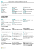

# <a name="work-with-includeprodshortincludesprodshortmd" />Utiliser [!INCLUDE[prod_short](includes/prod_short.md)]

Dans le cadre de l’exécution des tâches, vous interagissez avec des données de différentes manières : création d’enregistrements et saisie de données, tri et filtrage de données, rédaction de procédures et sortie de données vers d’autres applications.

Par exemple, vous pouvez ajuster la taille et la position de n’importe quelle page, étendre la largeur des colonnes et augmenter la hauteur des en-têtes de colonnes, puis modifiez le tri des données dans les colonnes. Si vous souhaitez utiliser la barre de défilement horizontale pour afficher toutes les colonnes dans une page de liste ou des lignes document, vous constatez la présence d’un volet Figer vertical pour empêcher le défilement de certaines colonnes.

[!INCLUDE [about-ui-learn](includes/about-ui-learn.md)]

## <a name="a-namecheatsheetatips-and-tricks" />Conseils

> [!TIP]
> Pour obtenir un aperçu facile à imprimer des fonctions les plus utilisées, sélectionnez l’image suivante et téléchargez le fichier PDF.
>
> 

## <a name="links-to-learn-more" />Liens pour en savoir plus

Le tableau suivant répertorie certaines des fonctionnalités générales et inclut des liens vers les rubriques qui les décrivent.

> [!NOTE]
> Outre les fonctionnalités d’interface utilisateur générales décrites de cette section, vous pouvez utiliser d’autres fonctionnalités générales davantage liées à l’entreprise. Pour plus d’informations, voir [Fonctionnalités d’entreprise générales](ui-across-business-areas.md).

| À  | Voir |
| --- | --- |
|Recherchez une page, un état, une action, une rubrique d’aide, ou une extension partenaire. |[Recherche de pages et d’informations avec Tell Me](ui-search.md) |
|Obtenez une vue d’ensemble des pages de votre rôle et d’autres rôles, puis accédez à ces pages.|[Recherche de pages avec l’explorateur de rôles](ui-role-explorer.md)|
| Filtrer les données dans des vues, des états, ou des fonctions en utilisant des symboles et des caractères spéciaux. |[Tri, recherche et filtrage de listes](ui-enter-criteria-filters.md) |
|Découvrez les nombreuses fonctionnalités générales qui vous permettent d’entrer des données de façon rapide et simple.|[Saisie de données](ui-enter-data.md)|
|Découvrez comment rapidement copier et coller des données y compris à l’aide des raccourcis clavier.|[FAQ sur l’opération Copier et coller](faq-copy-paste.yml)|
| Visualiser ou traiter les données dans des plages de dates spécifiques. |[Utiliser les dates civiles et les heures](ui-enter-date-ranges.md) |
| Vérifier quels champs doivent être renseignés. |[Détection de champs obligatoires](ui-mandatory-fields.md) |
|Découvrez comment les paramètres régionaux d’ordinateur affectent l’interface utilisateur et le site d’Aide et comment modifier la langue.|[Modification de la langue et des paramètres régionaux](about-locale-language.md)|
|Découvrez comment interagir avec Excel pratiquement de n’importe où dans [!INCLUDE[prod_short](includes/prod_short.md)]|[Affichage et édition dans Excel](across-work-with-excel.md)|
|Joignez des fichiers, ajoutez des liens ou écrivez des notes sur des fiches et des documents.|[Gérer les pièces jointes, les liens et les notes sur les fiches et les documents](ui-how-add-link-to-record.md)|
| Modifier les paramètres de base tels que la société, la date de travail et le tableau de bord. |[Modifier les paramètres de base](ui-change-basic-settings.md) |
|Soyez informé de certains événements ou modifications de statut, par exemple si vous êtes sur le point de facturer un client qui a un solde échu.|[Gérer les notifications](ui-smart-notifications.md)|
| Changez quels éléments d’interface utilisateur et où ils s’affichent pour s’adapter à vos préférences.|[Personnaliser votre espace de travail](ui-personalization-user.md) |
|Définissez, obtenez un aperçu, imprimez, ou enregistrez les états et définissez et exécutez des traitements par lots.|[Utiliser des états, des traitements par lots et des XMLports](ui-work-report.md)|
| Gérez le contenu et le format des états et des documents, dont les champs de données d’un ensemble de données de rapport apparaissant sur le rapport et la façon ils sont organisés, le style de texte, les images, et plus encore.|[Gestion des présentations de rapport et de document](ui-manage-report-layouts.md) |
|En savoir plus sur les fonctions et les capacités qui permettent aux personnes handicapées accéder facilement à [!INCLUDE[prod_short](includes/prod_short.md)].|[Accessibilité et raccourcis clavier](ui-accessibility.md)|

## <a name="getting-around-in-business-central" />Parcourir Business Central
Voici une courte vidéo sur la manière de parcourir [!INCLUDE[prod_short](includes/prod_short.md)].

> [!VIDEO https://www.youtube.com/embed/zqz03iMihx0]

## <a name="choosing-a-desktop-browser" />Choix d’un navigateur de bureau

[!INCLUDE[prod_short](includes/prod_short.md)] prend en charge plusieurs navigateurs qui offrent chacun diverses fonctions et fonctionnalités. Le navigateur joue un rôle important dans la réactivité et la fluidité de l’interface utilisateur. Consultez la liste des navigateurs pris en charge et recommandés pour [Business Central Online](./product-requirements.md) et des navigateurs pour [Business Central sur site](/dynamics365/business-central/dev-itpro/deployment/system-requirement-business-central-v15).

- Dans la mesure du possible, évitez les navigateurs plus anciens tels qu’Internet Explorer et privilégiez l’un de nos navigateurs modernes recommandés tels que le [nouveau Microsoft Edge](https://www.microsoft.com/edge/).  

    Internet Explorer n’est plus pris en charge. Pour en savoir plus, consultez [Documentation Microsoft Edge](https://support.microsoft.com/hub/4337664/microsoft-edge-help).
- Maintenez votre navigateur toujours à jour avec la dernière version.

## <a name="action-bars" />Barres d’action

Dans [!INCLUDE [prod_short](includes/prod_short.md)], vous effectuez la plupart de votre travail dans une liste, un document ou une carte. Les trois types de pages ont une barre avec des actions qui sont pertinentes pour la page particulière, et les actions sont presque les mêmes pour la carte ou le document individuel et pour la liste des entités. De cette façon, vous pouvez gérer une commande vente individuelle dans la page **Commandes vente** et dans la liste **Commandes vente**, y compris sa publication et sa facturation.  

Mais les actions peuvent également apparaître différemment, voire ne pas être présentes, selon la façon dont vous ouvrez la page. Notamment pour les pages de liste, la page de liste que vous ouvrez à partir de la page d’accueil et la page qui s’affiche lorsque vous la recherchez à l’aide de l’icône  ne sont pas identiques.  

Lorsque vous recherchez une page de liste ouverte, telle que la liste **Commandes vente**, elle est en mode visualisation. Les actions de modification, d’affichage ou de suppression d’une entité individuelle, telle qu’une commande client, s’affichent lorsque vous choisissez l’action **Gérer**.  

> [!TIP]
> Si vous savez que vous utiliserez souvent des actions sur ce deuxième niveau de la barre d’action, choisissez l’icône :::image type="icon" source="media/pin.png" border="false"::: pour épingler la barre d’action et afficher immédiatement les actions sous les différents menus.
>
> Pour faire à nouveau disparaître le deuxième niveau de la barre d’action, choisissez l’icône :::image type="icon" source="media/unpin.png" border="false":::.

Mais lorsque vous ouvrez la même page de liste à partir de votre page d’accueil, l’action **Gérer** n’est pas présente. Au lieu de cela, pour ouvrir une commande vente individuelle, il vous suffit de sélectionner le champ **Nombre**. Dans cette vue, vous ne pouvez pas épingler la barre d’action.  

## <a name="see-related-microsoft-trainingtrainingpathswork-pro-data-dynamics-365-business-central" />Voir la [formation Microsoft](/training/paths/work-pro-data-dynamics-365-business-central/) associée

## <a name="see-also" />Voir aussi

[Préparation aux activités commerciales](ui-get-ready-business.md)  
[Configuration de Business Central](setup.md)  
[Fonctionnalités marché](ui-across-business-areas.md)  
[Conseils hautes performances pour les utilisateurs professionnels](/dynamics365/business-central/dev-itpro/performance/performance-users?toc=/dynamics365/business-central/toc.json)

## <a name="includeprodshortincludesfreetrialmdmd" />[!INCLUDE[prod_short](includes/free_trial_md.md)]

[!INCLUDE[footer-include](includes/footer-banner.md)]
